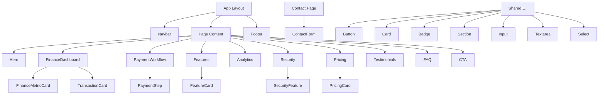

# Component Structure

## Explanation

The application uses a layered component hierarchy. The root layout wraps every page with Navbar and Footer. Page content is composed of section components, each responsible for a distinct part of the landing experience.

Fintech-specific components (FinanceMetricCard, TransactionCard, PaymentStep, etc.) handle domain UI patterns. Shared UI primitives (Button, Card, Input, etc.) provide consistent styling and behavior across the entire site.

Content is injected from `data/` files, keeping components presentation-focused and data files content-focused.
