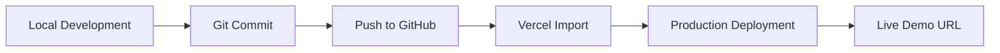

# Deployment



**Live Demo:** [https://fintech-landing-website-5jg8wso3o-valakasneckles-projects.vercel.app/](https://fintech-landing-website-5jg8wso3o-valakasneckles-projects.vercel.app/)

## Deployment Steps

1. Build locally with `pnpm build` to verify the production build.
2. Push the repository to GitHub (`Valakasneckle/08-fintech-landing`).
3. Import the repository into Vercel.
4. Deploy with default Next.js settings (no custom build command needed).
5. Copy the live production URL.
6. Add the live URL to `README.md` and `.env.example`.
7. Add the live URL to the GitHub repository **About** section.
8. Add the live URL to your LinkedIn profile and portfolio hub.

## Environment Variables

| Variable | Description |
|----------|-------------|
| `NEXT_PUBLIC_SITE_URL` | Production site URL for metadata and canonical links |

## Build Commands

```bash
pnpm install
pnpm build
pnpm start
```
