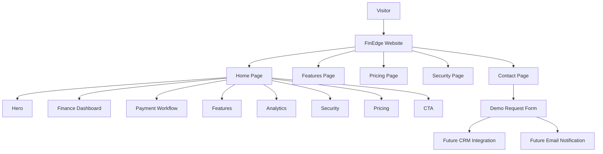

# System Overview

## Explanation

Visitors arrive at the FinEdge website and navigate across five pages: Home, Features, Pricing, Security, and Contact. The home page is the primary conversion surface, combining product positioning (Hero), proof of capability (Finance Dashboard, Payment Workflow, Analytics), trust signals (Security), commercial intent (Pricing), and repeated calls to action.

The contact page captures demo requests through a structured form. In a production deployment, submissions would route to a CRM system and trigger email notifications to the sales team.

All pages share a common layout (Navbar + Footer) and draw content from static data files in the `data/` directory.
