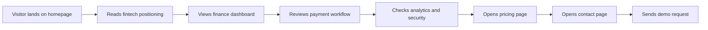

# User Flow

## Explanation

The conversion flow is designed to build trust progressively before asking for commitment.

1. **Positioning** — The hero section establishes FinEdge as a modern financial operations platform.
2. **Proof** — The finance dashboard and payment workflow demonstrate product capability with realistic UI.
3. **Depth** — Analytics and security sections address the concerns of finance decision-makers.
4. **Commercial** — Pricing presents clear plan options with transparent feature lists.
5. **Conversion** — The contact page captures demo requests with structured fields (role, company size, use case).

Repeated CTAs on every page provide conversion opportunities at multiple points in the journey.
